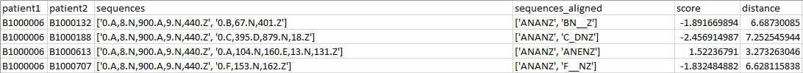

# TNW_Sequences_Aligner

The Needleman–Wunsch algorithm (NW) marked the genesis of a new field of research known as sequence alignment. Its inception was motivated by the growing need for 
automated methods to find homologous biological sequences. Subsequently, sequence alignment has established itself as a standard approach in bioinformatics, and has also 
been applied to other domains, including sequences of temporal events. Little prior work has been undertaken on alignment methods in using the temporal information 
associated with event sequences.

The Algorithm present in this repo is the Implementation of the Manuscript "Temporal Needleman Wunsch" by <b>Haider Syed & Amar K. Das.</b>
You can find the Paper on the Following Link : 
https://www.researchgate.net/publication/292331949_Temporal_Needleman-Wunsch

Below is an example aligning two sequences using TNW algorithm : 

You can find a usage Example of the TNW algorithm file where you have an example input dataset :

and those following are the results of the TNW ALgorithm : 

